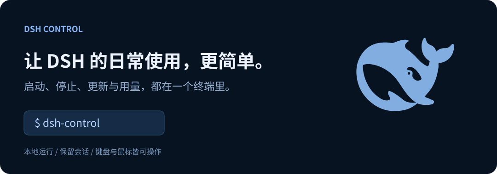
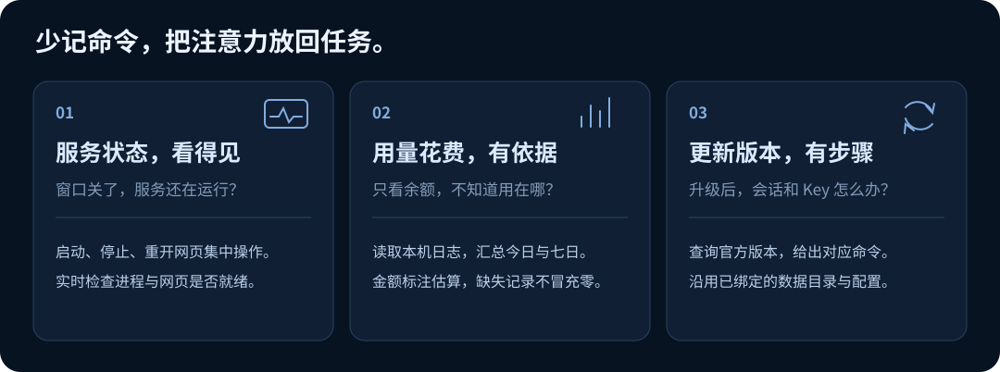
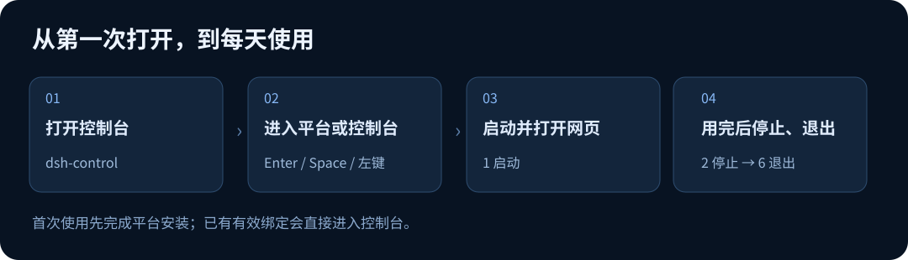

<p align="center"></p>

<p align="center"><a href="#快速开始">快速开始</a> · <a href="#第一次使用">第一次使用</a> · <a href="#每天怎么用">日常操作</a></p>

**DSH Control 是 DeepSeek Harness 的终端控制台。** 安装一次，之后在任意目录输入 `dsh-control`，就能启动或停止服务、重新打开聊天网页、检查运行状态，以及查看插件、技能、MCP 和用量信息。

这是为 DeepSeek Harness 开发的第三方启动控制器，对齐官方配置，拉取官方安装包，省心使用。实际聊天和任务执行仍由 [DeepSeek Harness](https://github.com/deepseek-ai/deepseek-harness) 完成。

## 亮点

- **省心接管 DSH 日常使用和更新。** 启动、停止、重开网页、自检和更新集中在一个入口，鼠标点击和数字快捷键都能用。通过控制台查询并跟进官方更新，省心使用。
- **自适应安装与持续追踪更新。** 已接入的环境直接进入控制台，尚未接入则显示安装引导：1. 已经使用 DSH 网页版，可以读取原有环境并绑定原 Key、配置与会话目录；2. 尚未安装，则准备官方 DSH 包，首次使用在网页中输入 Key。后续
- **网页关了，后台仍然可控。** 解决网页与服务端分离、不便管理的问题：关闭聊天网页后，仍可在控制台检查后台服务、重开网页、停止服务，无须在终端反复输入繁琐命令。
- **TUI 控制端，极速响应省资源。** 在终端完成日常控制，服务检查和数据读取在后台进行，聊天时也能随时回来查看状态。
- **一列展示dsh启停进程。** 左侧显示dsh启动的各个进程，清晰展示进程状态和耗时，支持停止、自检、中途重新拉起，随心掌控。
- **一屏概览dsh插件与技能配置。** 右侧显示dsh基础配置、插件、skills，插件、skills包含名称和概要，支持下拉或搜索，简洁明了。
- **一行览尽用量与高低峰时段。** 用量、估算金额、账户余额和高低峰时段集中在底部信息栏，使用决策所需信息一眼可见。

**您的最佳 DeepSeek Harness 启停与监控管家！**

## 它解决哪些问题



服务是否真的启动、网页为什么打不开，可以在“服务链路”和“结果与建议”中查看。用量不必手工汇总日志；升级也不必猜应该安装哪个版本。Control 把这些日常动作放在同一处，并保留失败原因和下一步提示。

## 快速开始

Windows、macOS、Linux 都需要先安装 [Node.js 24 或更新版本](https://nodejs.org/en/download)（含 npm），再按下面三步完成安装。使用 WSL 时，请在其 Linux 环境内安装 Node.js 和 DSH Control。

> **Windows 用户请使用 PowerShell 7。** 可以打开 [Microsoft Store](https://www.microsoft.com/store/apps/9MZ1SNWT0N5D)，搜索并安装 Microsoft 发布的 **PowerShell** 稳定版。安装后，从开始菜单打开 **PowerShell 7**，或重新打开终端后输入 `pwsh` 启动；使用 Windows Terminal 时，选择 PowerShell 7 对应的标签页。系统自带的 **Windows PowerShell 5.1** 和 **命令提示符（CMD）** 是不同的入口，版本检查方法见第 2 步。安装 Node.js 时，无须勾选 **Automatically install the necessary tools / Tools for Native Modules** 额外开发工具选项。

### 第 1 步：安装并检查 Node.js

通过上方 Node.js 官网链接，选择对应系统的安装方式。安装完成后，重新打开终端，依次执行：

```text
node --version
npm --version
```

第一条应显示 `v24.x.x` 或更高版本，第二条应显示 npm 的版本号。如果提示找不到命令，先检查 Node.js 是否安装完成，并关闭、重新打开终端后再试。WSL 用户需选择 Linux 安装方式，Windows 中安装的 Node.js 不能替代这一步。

### 第 2 步：确认终端入口

**Windows：** 在准备使用的 PowerShell 窗口中执行：

```text
$PSVersionTable.PSVersion
```

确认输出中 `Major` 为 `7`。如果显示 `5`，当前是 Windows PowerShell 5.1；如果在 CMD 中提示无法识别该命令，请按上方灰色提示安装并打开 PowerShell 7，再检查一次。仅打开“Windows Terminal”这个窗口，并不代表其中运行的是 PowerShell 7。

**macOS：** 打开“终端（Terminal）”，使用默认的 zsh 或 bash。

**Linux：** 打开系统的终端，使用 sh、bash 或 zsh。

**Windows / WSL：** 从开始菜单打开已安装的 Ubuntu，或在 Windows 的 PowerShell 中先查看发行版名称：

```text
wsl --list --verbose
```

然后进入对应发行版。例如，列表中名称为 `Ubuntu-24.04` 时执行：

```text
wsl -d Ubuntu-24.04
```

请将示例名称换成列表中实际的发行版名称；尚未安装 WSL 时，先按 [微软 WSL 安装说明](https://learn.microsoft.com/zh-cn/windows/wsl/install)完成安装。进入 Ubuntu 后，重新执行第 1 步的两条版本检查，再运行 `node -p "process.platform"`，确认输出为 `linux`，然后使用下方的 Linux / WSL 安装命令。后续安装、启动和使用都在这个 Linux 终端中进行。

### 第 3 步：执行安装命令

**Windows：** 在已确认版本的 PowerShell 7 中执行：

```text
irm https://raw.githubusercontent.com/wiFy909/dsh-control/main/bootstrap.ps1 | iex
```

**macOS：** 在“终端（Terminal）”中执行下方命令。**Linux / WSL：** 在 Linux 终端或已经进入的 Ubuntu 终端中执行同一条命令：

```text
curl -fsSL https://raw.githubusercontent.com/wiFy909/dsh-control/main/install.sh | sh
```

安装完成后，重新打开对应系统的终端，在任意目录输入：

```text
dsh-control
```

若提示“Control 已安装；DSH 接入尚未完成”，按上方错误提示处理，再执行 `dsh-control --setup`。已有 DSH 服务正在运行时，请先用原启动入口停止，再重试接入。

安装需要联网。如果 GitHub、Python 或 npm 下载受到网络限制，需要可用代理。

## 第一次使用



1. 输入 `dsh-control`，看到鲸鱼 logo 后，按 **Enter** 或 **Space**，也可以单击鼠标左键。
2. 安装器已完成接入时，直接进入控制台；否则选择实际运行的系统：**Windows、Windows / WSL、Linux 或 Mac**。
3. 根据安装页提示确认 Node.js 24+ 已就绪，执行 `dsh-control --setup`。它会读取已有环境；没有环境时安装官方 DSH 包。
4. 命令成功后回到 Control，点击 **安装完毕**。检查通过后进入控制台；存在多个安装时，按版本与目录选择要管理的那一个。
5. 点击 **1 启动**。服务与网页资源检查完成后，浏览器打开 DSH。**全新安装请在官方网页中输入模型 API Key；已有安装继续绑定原 Key，无须重复填写。**

**已经使用 DSH 网页版？** 安装命令会识别当前终端的 `DSH_HOME`，未设置时读取默认 `~/.dsh`；接入后可用 Control 代替原来的命令行启停方式，保留原配置、Key 和会话。使用 `npx` 的环境会另行准备持久程序目录，不把临时缓存当作长期安装目录。已有 Control 绑定则直接复用。

如原来使用自定义数据目录，可运行 `dsh-control --setup --dsh-home "/绝对路径/原DSH目录"`。原 Key 若只通过环境变量提供，请从具有相同变量的终端安装并启动 Control；若只存在于原工作目录的 `.env` 中，请先在官方网页保存 Key。Control 不会复制任意项目的凭据，也不会强行接管仍由其他入口运行的进程。

## 每天怎么用

| 操作 | 点击或按键 | 你会看到什么 |
|---|---|---|
| 开始使用 | **1 启动** | 检查环境和安装，启动服务，再打开聊天网页。受管服务已运行时复用现有进程。 |
| 结束服务 | **2 停止** | 正常停止受管进程；等待状态变为“已停止”。 |
| 找回网页 | **3 重开网页** | 重新打开正在运行的 DSH。关闭浏览器标签页不会停止服务。 |
| 排查故障 | **4 运行自检** | 查看环境、进程、Web 服务和访问链路；具体原因显示在“结果与建议”。 |
| 更新 DSH | **5 更新** | 查询官方版本，按页面提示安装并核实新版；继续使用原数据目录。 |
| 退出 Control | **6 退出** | 服务已停止时返回终端；仍在运行时提醒先停止。`Q`、`Ctrl+C` 使用同一规则。 |

日常最常用的顺序是：**打开 Control → 1 启动 → 在浏览器里使用 DSH → 2 停止 → 6 退出**。

右侧可以切换 **插件、技能、MCP**，搜索当前列表并滚动查看详情。这部分用于浏览，不会因为点击条目就安装或删除扩展。小窗口中按 **V** 在服务链路和详情之间切换；按 **Tab** 切换焦点。

### 用量、金额和账户余额

**一行览尽使用决策所需信息。** 接入正在使用的 DSH 后，Control 读取其 Key 查询官方账户余额，同时汇总本地会话中的今日、近七日和记录日均用量及估算金额，并与北京时间的高低峰时段、倒计时集中显示。窗口较小时压缩数值展示，鼠标悬停可看完整数字。

新用户在 DSH 网页保存 Key 后，Control 会在后续账户刷新时读取；也可点击左下角 **账户**（或按 **A**），选择 **沿用 DSH** 立即读取，或单独输入用于余额查询的 Key。手动输入支持“仅本次”和系统密钥库“安全保存”。读取 DSH Key 不会另存、改写或删除原凭据；手动配置的账户 Key 优先，点击“沿用 DSH”可切回原账户。

用量来自本地会话记录，**账户余额由官方接口查询，估算金额不等于实际账单**。Control 按当前版本已核实的价格规则估算费用；记录不完整、价格规则过期或不适用时，会提示无法可靠估算，仍保留可读取的 Token 用量。没有记录时显示“—”。余额请求只发送至 `api.deepseek.com`，本地统计不会上传会话正文。

## 常见问题

**输入 `dsh-control` 提示找不到命令？** 重新打开终端再试。Mac/Linux 的命令安装在 `~/.local/bin`；Windows 的命令目录会加入用户 PATH。安装时出现错误，则先处理错误并重新安装。

**我想直接输入 `dsh` 打开 Control。** 默认保留已有 `dsh` 命令；如需替换用户命令目录中的入口，安装时明确追加选项：

Windows PowerShell 7：下载安装脚本并附加选项执行：

```text
$installer = Join-Path $env:TEMP "dsh-control-install.ps1"
Invoke-WebRequest https://raw.githubusercontent.com/wiFy909/dsh-control/main/bootstrap.ps1 -OutFile $installer
pwsh -NoProfile -ExecutionPolicy Bypass -File $installer --replace-dsh
```

macOS / Linux / WSL：

```text
curl -fsSL https://raw.githubusercontent.com/wiFy909/dsh-control/main/install.sh | sh -s -- --replace-dsh
```

旧启动脚本会备份到 Control 程序目录的 `previous-commands`，官方 DSH 不会被卸载。

**旧 `npx` 命令提示 `EALLOWREMOTE`？** 这是 npm 拒绝远程 tarball，重新安装 Node.js 开发工具不能解决它。请改用上方 PowerShell / shell 安装命令，无须修改全局 npm 策略。

**WSL 卸载时资源管理器提示找不到路径？** 请在 Ubuntu 终端中按下方的卸载范围操作，避免从 Windows 资源管理器逐项删除 Linux 的符号链接；先停止服务并保留 DSH 数据目录。

**点击启动后没打开网页？** 查看“结果与建议”，再运行自检。服务已经就绪、只是关掉了网页时，点击“3 重开网页”。自检不会发起模型对话，不能证明 Key 有效或余额充足。

**鲸鱼 logo 不完整或文字太挤？** 建议使用 120 列、30 行左右的终端窗口。80×24 下可按 V 切换内容区域；字体不支持细点阵时，运行 `dsh-control --glyph-mode block`。中文等宽字体会让边框更整齐。

**如何卸载？** 先停止服务并退出 Control。Mac/Linux 删除 `~/.local/share/dsh-control/app` 和 `~/.local/bin/dsh-control`；Windows 删除 `%LOCALAPPDATA%\dsh-control\app` 与 `%LOCALAPPDATA%\dsh-control\bin\dsh-control.cmd`。如替换过 `dsh`，请先从 `app/previous-commands` 恢复旧入口，再删除程序目录。需要释放安装器准备的 Python 时，也可删除同级 `python` 目录。DSH 程序、会话、Key 和控制记录保留，另行备份后再决定是否删除。

PATH 清理方法：

- **Mac/Linux：** zsh 检查 `~/.zprofile`、`~/.zshrc`；bash 或其他 shell 检查 `~/.profile`、`~/.bashrc`。运行下面的命令定位安装器追加的 `# DSH Control user commands`，用文本编辑器打开对应文件，删除该注释和紧随其后的 `export PATH=...` 一行，保存并重新打开终端。若 `~/.local/bin` 还供其他工具使用，请保留这一 PATH 设置。

  ```text
  grep -n -A 1 'DSH Control user commands' ~/.zprofile ~/.zshrc ~/.profile ~/.bashrc 2>/dev/null
  ```

- **Windows：** 开始菜单搜索“编辑账户的环境变量”，在“用户变量”中选中 `Path` →“编辑”，只删除 `%LOCALAPPDATA%\dsh-control\bin` 对应的完整路径项，保存并重新打开终端。可在 PowerShell 中用 `[Environment]::GetEnvironmentVariable('Path','User') -split ';'` 查询当前各项。

## 参与开发

欢迎参与开发，共同打造最好用的高效、极速、省心的 DSH TUI Control！欢迎提交 Issue、改进建议与 Pull Request；反馈时附上系统、终端和操作步骤，并隐去 Key、个人路径与会话内容。

本项目采用 [MIT License](LICENSE)。感谢 DeepSeek Harness、Textual、Rich、Pillow 及其他依赖；鲸鱼 logo 的来源与许可证见[资源目录](dsh_control_app/assets/brand/PROVENANCE.txt)，各项目遵循各自许可证。
